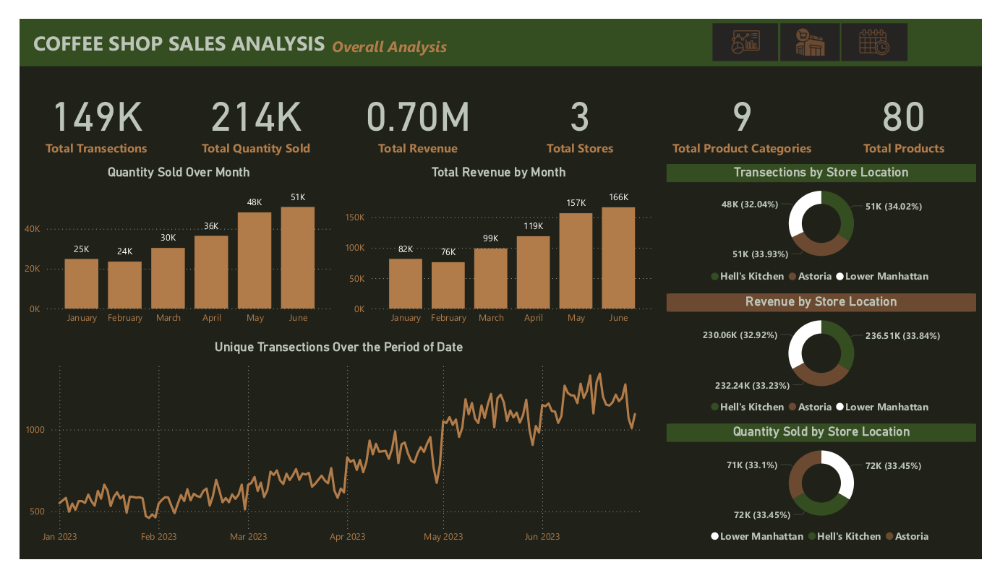
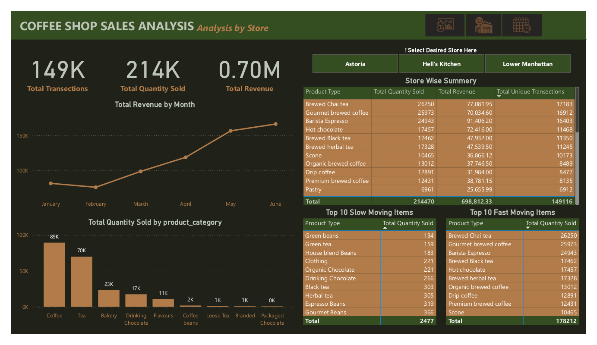
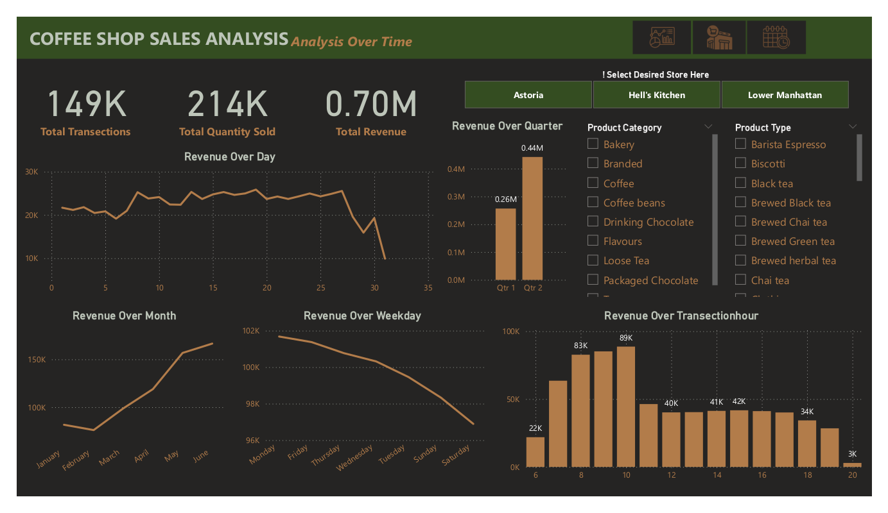

# Coffee Shop Sales Analysis Report

## Live Report
**View the live interactive Power BI report here:**
[Click to Open Report](https://app.powerbi.com/view?r=eyJrIjoiYWI4ZmYxMmQtOWQ2Yi00MjQ4LTgzZDItOGI1M2MwYTI5NzU3IiwidCI6IjI1Y2UwMjYxLWJiZDYtNDljZC1hMWUyLTU0MjYwODg2ZDE1OSJ9
)  
*(Hosted on Power BI Service)*
## Project Overview 

This Power BI project presents a comprehensive sales analysis for a fictional coffee shop business with 3 store locations and 80 products spread across 9 product categories. The dashboard is designed to help stakeholders monitor performance, optimize product strategy, and identify growth opportunities through data driven insights.

## Key Insights

- Monthly revenue increased steadily from $82K in January to $166K in June, indicating successful sales strategies and seasonal growth.
- All three stores, Hell’s Kitchen, Astoria, and Lower Manhattan contributed nearly equally to revenue and transactions, with slight differences in product preference.
- Coffee and Tea categories dominated sales, accounting for the majority of both revenue and quantity sold.
- Top 3 items by quantity sold:
    - Brewed Chai Tea – 26,250 units
    - Gourmet Brewed Coffee – 25,973 units
    - Barista Espresso – 24,943 units
- Least sold items included Green Beans, Green Tea, and Organic Chocolate, indicating potential overstock or low demand.
- Sales peaked during 10 AM–12 PM across all locations.
- Weekends showed stronger performance than weekdays, with Friday and Saturday being top-performing days.
- Over 149,000 transactions processed, highlighting the scale of operations.
- Each store generated over $230K in revenue, with Hell’s Kitchen slightly leading in overall revenue share.

##  Dataset Information 

- **Data Source:** Maven Analytics (https://app.mavenanalytics.io/guided-projects/72ec0a0d-bc7d-4ac4-a8da-da811f9061d6)  
- **File Type:** Excel
- **Time Period:** 2023/01/31 - 2023/06/31 
- **File Size:**  8.6 MB
- **Number of Table:** 1
  - Order Details Table - 404 KB / Number of Fields(11) 
- **Number of Record:** 149,116 (Number of Orders)

## Tools & Technologies Used 

- Power BI (Data Modeling/Data Visualization)  
- Power Query (Data Extracting/Data Cleaning)

## Project Workflow 

1.**Data Collection & Import**
  - Gathered raw sales data covering transactions, product categories, store locations, and quantities sold over a 6-month period.
  - Imported the dataset into Power BI Desktop for transformation and visualization.

2.**Data Cleaning & Transformation**
  - Used Power Query Editor to:
    - Remove nulls and inconsistencies
    - Format date columns and currency values
    - Normalize categorical fields (e.g., product names, categories)
  - Created new columns to support time-based analysis (month, weekday, quarter).

3.**Data Modeling**
  - Defined hierarchies for time-based exploration (year > quarter > month).

4.**DAX Measures Creation**
  - Built custom DAX measures for,
    - Total Revenue
    - Total Transactions
    - Total Quantity Sold
   
5.**Dashboard Design**
  - Developed three interactive report pages in Power BI,
    - Oveall Analysis
    - Analysis by Store
    - Analysis Over Time
  - Implemented navigation buttons for seamless movement between pages
  - Ensured the dashboard is clean, responsive, and user-friendly, with interactive slicers and consistent design across all visuals

6.**Insight Extraction & Presentation**
  - Identified key business insights (top products, peak hours, store-level trends).
  - Delivered the report in PBIX, PDF, and Power BI Service formats for accessibility.

## Dashboard Preview 

 

 

 

## Project Structure 

<pre style="background: #fff; padding: 0; border: none; font-family: monospace;">
📂 Coffee-Shop-Sales-Analysis/ 
  │-- 📁 Icons/ # Report icons   

  │-- 📁 RawData/ # Contains raw and processed datasets 
  
        |-- Coffee Shop Sales.xlsx
        
  │-- 📁 Report_Snapshots/ # Report images
    
        |-- OverallAnalysis.png

        |-- StoreAnalysis.png

        |-- TimeAnalysis.png
  
  │-- 📁 CoffeeShopSales.pbix/ 
  
  │-- 📁 CoffeeShopSalesAnalysis.pdf/ 

  │-- 📄 LICENSE/ # License Details/ 
  
  │-- 📄 README.md # Project documentation/

  
</pre>

## How to Use 
- Use the web [link](https://app.powerbi.com/view?r=eyJrIjoiYWI4ZmYxMmQtOWQ2Yi00MjQ4LTgzZDItOGI1M2MwYTI5NzU3IiwidCI6IjI1Y2UwMjYxLWJiZDYtNDljZC1hMWUyLTU0MjYwODg2ZDE1OSJ9) to view the report online, or download the [CoffeeShopSales.pbix](CoffeeShopSales.pbix) file to access and edit it using Power BI Desktop.
- This report contains tHREE interactive pages:

  1.Overall Analysis
  
  2.Store Analysis

  3.Analysis Over Time
  
- At the top-right corner of each report page, there is  navigation buttons that help user to move between pages, These buttons make it easy to explore each layer of the report interactively and in a logical flow.
- Use the attached [CoffeeShopSalesAnalysis.pdf](CoffeeShopSalesAnalysis.pdf) file to read a detailed overview of the report and share it easily with others
## Future Improvements 

- Add customer segmentation and loyalty tracking
- Integrate real-time data sources
- Include forecasting using AI visuals
- Expand analysis to include inventory and supplier metrics
  
## References

- Maven Analytics: [Dataset](https://app.mavenanalytics.io/guided-projects/d7167b45-6317-49c9-b2bb-42e2a9e9c0bc)
- Power BI Documentation: [Learn More](https://learn.microsoft.com/power-bi/)

