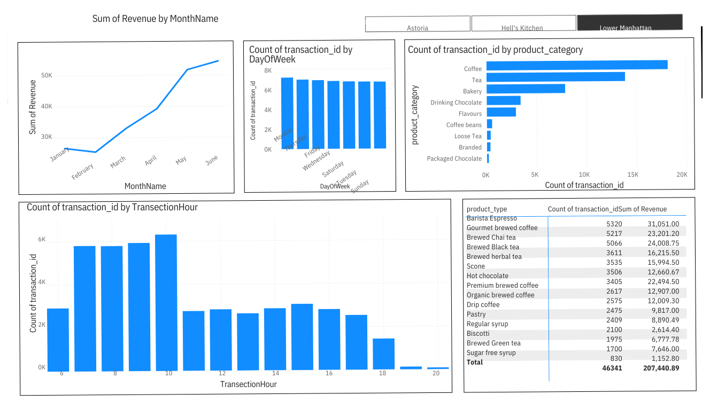

# CoffeeShopSales
Coffee Shop Sales Analysis From 1/1/2023 To 6/1/2023

# Coffee Shop Sales Dashboard

## 📌 Project Overview

This Power BI dashboard provides an in-depth analysis of a coffee shop's sales performance. It helps in understanding revenue trends, customer behavior, and product performance.

## 🛠️ Technical Stack

- **Power BI** – Used for data visualization and dashboard creation.
- **Power Query** – Data cleaning and transformation.
- **DAX (Data Analysis Expressions)** – Used for advanced calculations and measures.
- **Excel/CSV** – Data source format before importing into Power BI.

## 📊 Key Insights

- **Revenue by Month**: Tracks monthly sales trends.
- **Transactions by Day of the Week**: Identifies peak business days.
- **Transactions by Hour**: Reveals the busiest hours of the day.
- **Sales by Product Category & Type**: Analyzes top-selling items and revenue contribution.

## 🖼️ Dashboard Preview

## 📂 Data Source & Preparation

- **Dataset Description:** The dataset includes transaction records from the coffee shop's POS system.
- **Fields Used:**
  - `Transaction ID` – Unique identifier for each sale.
  - `Date & Time` – Timestamp of each transaction.
  - `Product Category` – Classification of items (e.g., Coffee, Tea, Bakery, etc.).
  - `Product Type` – Specific items within each category.
  - `Revenue` – Sales amount for each transaction.
- **Data Processing Steps:**
  - Imported raw sales data from CSV.
  - Cleaned and transformed data using Power Query.
  - Created calculated columns and measures using DAX.
  - Built interactive visualizations in Power BI.

## 🔍 Business Insights

- **Peak Sales Periods:**
  - Most sales occur on **Fridays and Saturdays**.
  - Revenue is highest between **8 AM - 10 AM** and **4 PM - 6 PM**.
- **Top-Selling Products:**
  - **Barista Espresso** and **Gourmet Brewed Coffee** generate the most revenue.
  - **Pastries and Scones** are popular complementary purchases.
- **Opportunities for Growth:**
  - Introducing loyalty programs during off-peak hours can boost sales.
  - Offering bundled deals on lower-performing products may increase revenue.

## 🚀 How to Use the Dashboard

1. Open the Power BI file (.pbix) in Power BI Desktop.
2. Interact with the visuals to explore sales trends.
3. Filter data by month, day, or product category for deeper insights.

## ⚠️ Challenges & Solutions

- **Challenge:** Inconsistent timestamps in the raw data.
  - **Solution:** Used Power Query to standardize date and time formats.
- **Challenge:** Large dataset affecting performance.
  - **Solution:** Optimized DAX measures and applied aggregations to improve efficiency.
- **Challenge:** Missing product categories in some transactions.
  - **Solution:** Applied data validation rules and imputed missing values where possible.

## 🔄 Future Improvements

- Add customer segmentation analysis.
- Include forecasting models for revenue predictions.
- Enhance visuals with additional KPIs.

